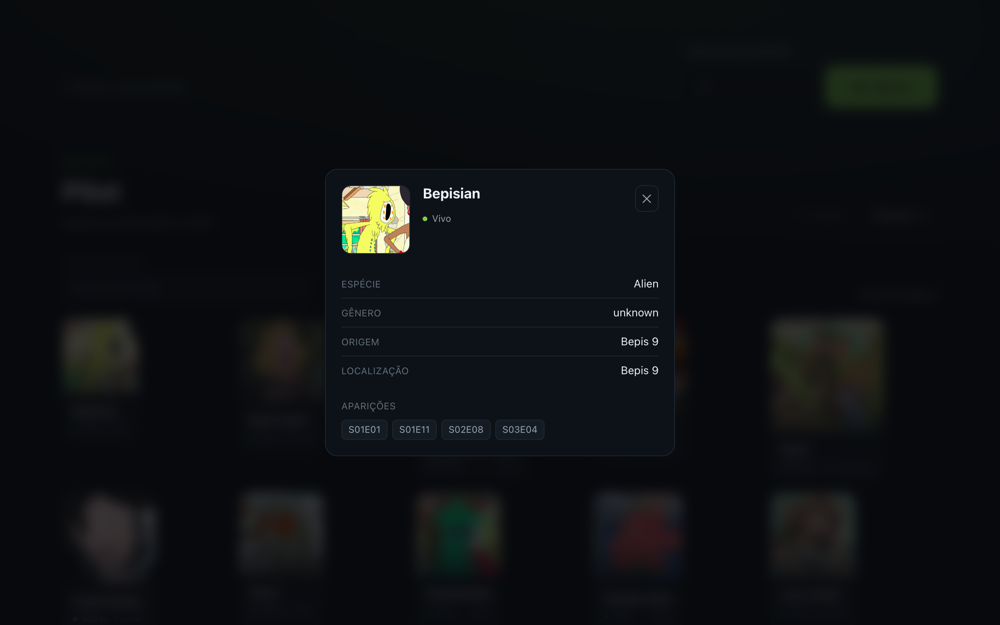

# Elenco por Episódio — Rick and Morty

Informe o número de um episódio e veja todo o elenco em ordem alfabética.

Construído sobre a [Rick and Morty API](https://rickandmortyapi.com/documentation).


| Elenco do episódio         | Detalhe do personagem        |
| -------------------------- | ---------------------------- |
|  |  |

---

## Começando

```bash
pnpm install
pnpm dev
```

O front sobe em `http://localhost:3000` e o BFF em `http://localhost:3333`.

Com Docker:

```bash
docker compose up --build
```

Requisitos: Node 22+ e pnpm 11+.

---

## O que foi priorizado

Desempenho era o requisito central, então a primeira coisa foi investigar a
origem antes de escrever código. Três descobertas moldaram o resto:

| Descoberta                                              | Consequência                                         |
| ------------------------------------------------------- | ---------------------------------------------------- |
| O catálogo é finito: 51 episódios, 826 personagens      | As páginas podem ser geradas na construção           |
| A origem declara `cache-control: immutable` por 90 dias | O cache pode ser agressivo, com respaldo do contrato |
| `/character/1,2,3` aceita lote                          | Nenhuma consulta em N+1                              |

O episódio mais populoso da série tem **65 personagens**. Sem lote, seriam 65
requisições para montar uma única tela.

### Resultados medidos

| Operação                         | Tempo        |
| -------------------------------- | ------------ |
| Página de episódio (estática)    | **3 a 5 ms** |
| Resposta vinda da origem         | 260 ms       |
| Resposta vinda do cache          | **1,2 ms**   |
| 404 de episódio inexistente      | 3 ms         |
| Construção completa (55 páginas) | 55 s         |

Medições locais com `next start`. A construção não faz requisição alguma: o
catálogo é obtido uma vez, antes dela — ver
[ADR 6](docs/adr/0006-rate-limit-nao-documentado-da-origem.md).

---

## Arquitetura

O núcleo não conhece framework algum. Dois adaptadores de entrada o consomem.

```
                    ┌──────────────────────────────┐
   Navegador ─────► │  apps/web — Next.js 16.3     │
                    │  51 rotas estáticas          │
                    └───────────────┬──────────────┘
                                    │
                                    ├──────────────┐
                                    ▼              │
                    ┌──────────────────────────────┴───┐
                    │  packages/core                   │
                    │                                  │
                    │  domain/       Cast, ordenação   │
                    │  application/  casos de uso      │
                    │      ports/    EpisodeGateway    │
                    │                CharacterGateway  │
                    │                CacheStore        │
                    │  infrastructure/  adaptadores    │
                    └──────────────────▲───────────────┘
                                       │
                    ┌──────────────────┴───────────┐
   Outros    ─────► │  apps/bff — Fastify          │
   clientes         │  mesmo caso de uso, por HTTP │
                    └──────────────────────────────┘
```

As dependências apontam para dentro. `domain/` não importa nada — nem
biblioteca externa. `application/` conhece `domain/`, mas não conhece HTTP,
Next, Fastify ou a API de origem.

O mesmo `GetEpisodeCastUseCase` roda sob os dois adaptadores. É o que torna a
separação verificável em vez de apenas declarada.

### Onde mora cada decisão

```
packages/core/src/
├── domain/                     regras que independem de tecnologia
│   ├── episode-cast.ts           agregado: ordenação alfabética
│   ├── episode-number.ts         objeto de valor: validação
│   └── errors.ts                 erros sem noção de HTTP
├── application/
│   ├── ports/                    contratos de saída
│   └── use-cases/                orquestração
├── infrastructure/
│   ├── http/                     cliente da origem, semáforo, contratos
│   └── cache/                    memória e no-op
└── composition-root.ts         único ponto que monta as dependências
```

---

## Decisões

Cada uma registrada com contexto e consequências em [`docs/adr`](docs/adr).

|                                                              | Decisão                                                                       |
| ------------------------------------------------------------ | ----------------------------------------------------------------------------- |
| [1](docs/adr/0001-arquitetura-hexagonal-proporcional.md)     | Arquitetura hexagonal proporcional — e o que foi deixado de fora de propósito |
| [2](docs/adr/0002-geracao-estatica-das-rotas-de-episodio.md) | Geração estática das 51 rotas                                                 |
| [3](docs/adr/0003-dois-adaptadores-de-entrada.md)            | Dois adaptadores sobre o mesmo núcleo                                         |
| [4](docs/adr/0004-ordenacao-como-regra-de-dominio.md)        | Ordenação como regra de domínio                                               |
| [5](docs/adr/0005-sem-banco-de-dados.md)                     | Ausência de banco de dados                                                    |
| [6](docs/adr/0006-rate-limit-nao-documentado-da-origem.md)   | Convivência com o rate limit da origem                                        |
| [7](docs/adr/0007-status-404-com-cache-components.md)        | 404 real com Cache Components                                                 |
| [8](docs/adr/0008-escopo-restrito-do-tanstack-query.md)      | Escopo restrito do TanStack Query                                             |
| [9](docs/adr/0009-escolha-do-framework-http.md)              | Escolha do framework HTTP                                                     |
| [10](docs/adr/0010-testes-em-tres-niveis.md)                 | Testes em três níveis                                                         |

### Três pontos que merecem destaque

**A ordenação usa `Intl.Collator`, não `sort()`.** O conjunto de dados contém
nomes acentuados — "Ábradolf Lincler" entre eles. Comparação por ponto de
código os lançaria depois do "Z". Empates são resolvidos pelo identificador,
para que a saída seja determinística entre construções.

**A origem tem limite de requisições não documentado.** A primeira tentativa de
gerar as 51 páginas falhou com HTTP 429, e na integração contínua o problema era
pior, porque o endereço de saída é compartilhado. Resolvido separando obter
dados de renderizar páginas: doze requisições em lote antes da construção, e
nenhuma durante. A construção caiu de 55 para 4,5 segundos e ficou
determinística.

**`notFound()` não devolvia 404.** Com Cache Components, o invólucro estático
parte antes do conteúdo transmitido, então `/episode/999` respondia 200 com a
tela de erro. Um proxy valida o número contra o catálogo antes de qualquer
renderização.

---

## Testes

```bash
pnpm test        # unitários e de integração
pnpm test:e2e    # ponta a ponta
```

| Camada        | Casos         | Cobertura      |
| ------------- | ------------- | -------------- |
| Núcleo        | 87            | 99%            |
| BFF           | 26            | 100%           |
| Front         | 57            | 100% de linhas |
| Ponta a ponta | 13 × 2 perfis | —              |

Os cenários de ponta a ponta usam o auxiliar `instant()` do Next 16.3, que
afirma que a troca de episódio pinta a tela **sem esperar a rede**. Regressão de
desempenho falha a suíte.

Foi esse nível que revelou um defeito real no painel de detalhe, invisível para
os testes unitários — descrito no
[ADR 10](docs/adr/0010-testes-em-tres-niveis.md).

---

## API

O BFF expõe:

```
GET /health
GET /api/episodes
GET /api/episodes/:id/cast
```

```bash
curl localhost:3333/api/episodes/28/cast
```

```json
{
  "episode": {
    "number": 28,
    "name": "The Ricklantis Mixup",
    "code": "S03E07",
    "airDate": "September 10, 2017"
  },
  "characters": [
    {
      "id": 8,
      "name": "Adjudicator Rick",
      "status": "Dead",
      "species": "Human",
      "imageUrl": "https://rickandmortyapi.com/api/character/avatar/8.jpeg"
    }
  ],
  "meta": { "total": 65, "source": "origin" }
}
```

O cabeçalho `x-cache-source` indica `origin` ou `cache` — útil para observar o
cache funcionando em tempo real.

| Situação             | Status |
| -------------------- | ------ |
| Número inválido      | 400    |
| Episódio inexistente | 404    |
| Origem indisponível  | 502    |

---

## Comandos

| Comando          | Efeito                             |
| ---------------- | ---------------------------------- |
| `pnpm dev`       | Sobe front e BFF                   |
| `pnpm build`     | Constrói tudo                      |
| `pnpm test`      | Testes unitários e de integração   |
| `pnpm test:e2e`  | Cenários ponta a ponta             |
| `pnpm lint`      | oxlint nos três pacotes            |
| `pnpm typecheck` | Verificação de tipos               |
| `pnpm format`    | Prettier                           |
| `pnpm docker:up` | Sobe os dois serviços em contêiner |

Variáveis de ambiente em [`.env.example`](.env.example). Todas têm valor padrão
funcional; nenhuma é obrigatória.

---

## Stack

Next.js 16.3 · React 19 · Fastify 5 · TypeScript 7 · Zod 4 · TanStack Query 5 ·
Tailwind 4 · Vitest 4 · Playwright · oxlint · Turborepo · pnpm
